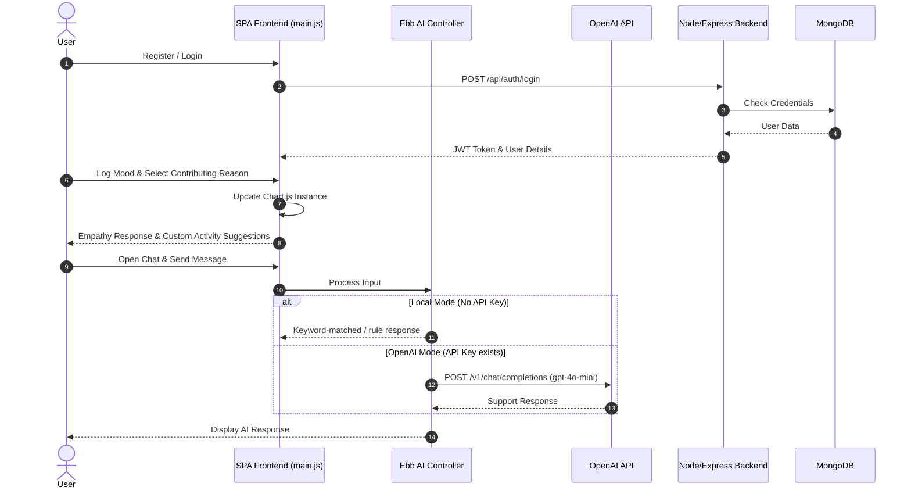

# WellMind Project Overview

Welcome to the **WellMind** development overview. This document provides a structural layout of the application's components, technology architecture, features, and interface elements based directly on the codebase analysis.

---

## 1. Project Description
WellMind is a comprehensive, premium mental wellness and mindfulness web application designed to help users manage stress, sleep better, and improve focus. The platform combines interactive features—including procedurally synthesized audio soundscapes, data-driven mood tracking, mindful grounding games, and clinical assessments—with an empathetic conversational companion to deliver a modern, accessible self-care experience.

---

## 2. Technology Stack

WellMind employs a modern stack split between a fast, modular client-side SPA and a robust database-backed authentication server.

| Layer | Technologies / Library | Details |
| :--- | :--- | :--- |
| **Frontend Core** | HTML5, CSS3, JavaScript (ES6+) | Single-Page Application (SPA) utilizing a hashchange-based dynamic client-side router. |
| **Styling & UI** | Custom CSS Variables, Outfit Google Font | Premium dark-themed, glassmorphism design system featuring micro-animations, custom icons, and dynamic hover feedback. |
| **Asset Compiler** | Vite | High-performance bundling and hot-reloading for development and production. |
| **Audio Engine** | Web Audio API | Procedural sound synthesis engine that dynamically generates natural sounds (Ocean Waves, Pink Rain, Binaural Theta Beats, Zen Chimes) client-side, reducing media size to 0 bytes. |
| **Data Analytics** | Chart.js | Renders responsive mood charts allowing users to track their emotional trends week-over-week. |
| **Backend Server** | Node.js, Express.js | Exposes REST API endpoints for user registration, authentication, and secure profile management. |
| **Database** | MongoDB, Mongoose ODM | Stores encrypted user details, stress indicators, and primary wellness goals. |
| **Security** | JWT, bcryptjs | JSON Web Tokens for secure session persistence; salt-based hashing for credentials. |

---

## 3. Recommended Screenshots & Visuals
To highlight the key features of the application, include the following screenshots in documentation:

1. **Dashboard Home Page**: Features the primary mood check-in panel, the interactive **Chart.js** weekly mood tracking widget, and the personalized, dynamic recommendation grid generated based on the logged mood.
2. **Ambient Soundscape Player**: Displays the active procedural audio cards (e.g., Ocean Waves, Midnight Launderette), progress bars, and custom start/stop audio controls.
3. **Ebb AI Chatbot Companion**: Shows the sleek messaging thread of the conversational interface, styled with responsive speech bubbles and status updates.
4. **Interactive Mindful Games**: Captures the canvas/visualizers for mindfulness mini-games (e.g., the *Lotus Pond Grounding* canvas, *Breathing Bubbles* interactive pop game, and *Zen Sand Garden*).
5. **Therapy portal & Clinical Assessment**: Displays the clean multi-step PHQ-9/GAD-7 questionnaires and therapist scheduling profile cards.

---

## 4. Chatbot Features (Ebb AI Companion)
WellMind includes **Ebb**, a 24/7 compassionate mental health companion. It operates in two smart execution modes:

> [!NOTE]
> **Offline Local Mode (Rule-based)**:
> Runs a local string matching engine detecting emotions (sadness, anxiety, happiness, greeting) and responds instantly with calming, empathetic support without network lag.

> [!TIP]
> **Online Cloud Mode (OpenAI GPT Integration)**:
> If the user sets an `OPENAI_API_KEY` in their browser's `localStorage`, Ebb dynamically upgrades to communicate directly with OpenAI's `gpt-4o-mini` API, providing sophisticated, deeply personalized, and contextual responses.

---

## 5. System Diagrams & UML

The diagrams below map the overall system structure and transactional flows of WellMind.

### System Architecture
```mermaid
graph TD
    subgraph Client [Browser Client (SPA)]
        UI[index.html & UI Components]
        Router[Hash-based JS Router]
        AudioEngine[Web Audio API Synthesis Engine]
        MoodTracker[Mood Tracker & Chart.js]
        EbbChat[Ebb AI Chatbot Controller]
    end

    subgraph External [External Services]
        OpenAI[OpenAI Chat API]
    end

    subgraph Backend [Backend API Server]
        Express[Express.js Server]
        Mongoose[Mongoose ODM]
        Auth[Auth Middleware & bcrypt]
    end

    subgraph Database [Database Layer]
        MongoDB[(MongoDB Database)]
    end

    UI --> Router
    Router --> AudioEngine
    Router --> MoodTracker
    Router --> EbbChat
    EbbChat -->|Optional OPENAI_API_KEY| OpenAI
    
    UI -->|API calls: auth/register, auth/login| Express
    Express --> Auth
    Express --> Mongoose
    Mongoose --> MongoDB
```

### Authentication & Interactive Engagement Sequence

